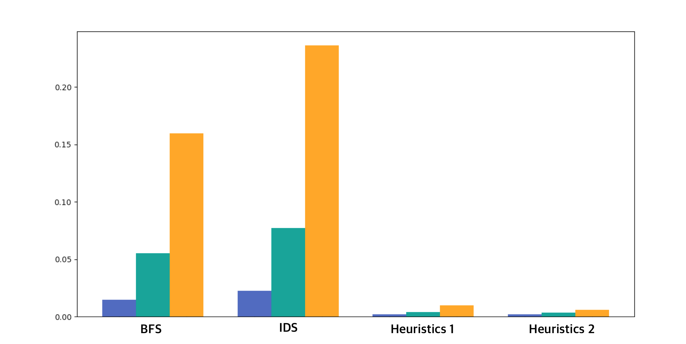

# Artificial-Intelligence-Assignments
학교 인공지능 강의 과제 레포지토리

## 8 Puzzle

### Average Elapsed Time Table

|steps	| BFS 		| IDS 		|Heuristics 1	|Heuristics 2	|
|---	|---		|---		|---			|---	        |
| 10 	| 0.01476s  | 0.02255s  | 0.00201s 	    | 0.00202s 	    |
| 15 	| 0.05541s  | 0.07743s  | 0.00406s 	    | 0.00348s 	    |
| 20 	| 0.15962s	| 0.23653s	| 0.00997s		| 0.00609s 	    |

steps 만큼 섞은 후 (움직임은 랜덤하게 지정함) 특정 알고리즘으로 풀게 하였다. 랜덤하게 섞어, 각각의 시행마다 차이가 존재하여, 충분히 큰 수인 1000번 시행 후 평균을 내었다.

### 결과

### 참고

Heuristics 1과 2는 A Star 방식의 탐색 알고리즘이다.

Heuristics 1은 잘못 놓은 타일의 갯수를 h 함수로 두었다. 반면 Heuristics 2는 전체 Manhattan Distance를 h 함수로 두었다.