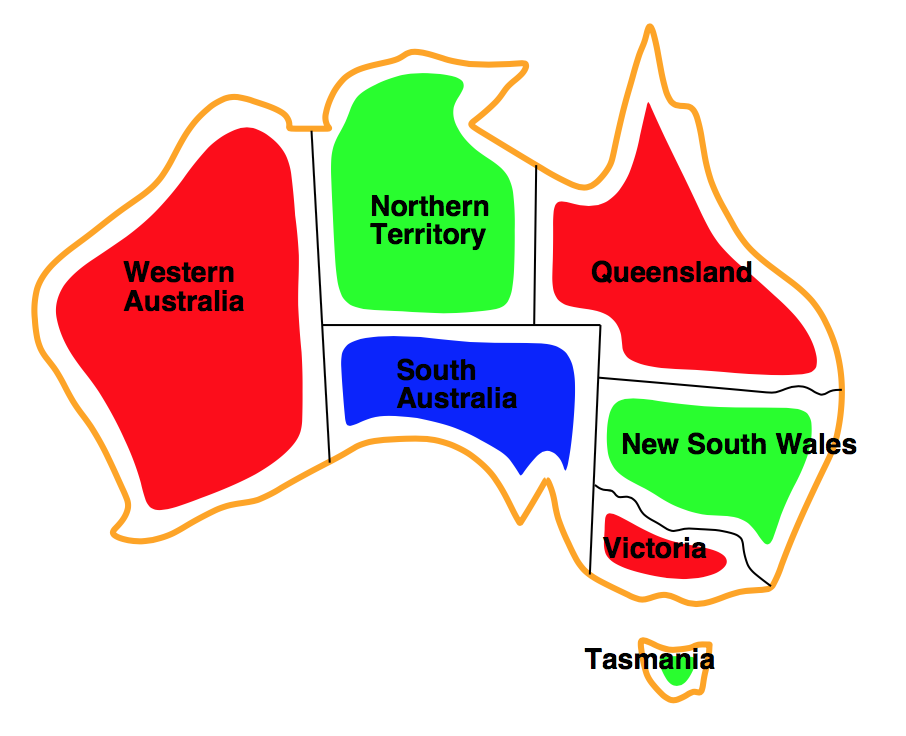

# Artificial-Intelligence-Assignments
학교 인공지능 강의 과제 레포지토리

## ???!!

서울시립대학교 2017년 2학기 인공지능 수업을 들으면서 구현한 코드나, 결과를 모아놓은 저장소입니다.

## 8 Puzzle

### Average Elapsed Time Table

|steps	| BFS 		| IDS 		|Heuristics 1	|Heuristics 2	|
|---	|---		|---		|---			|---	        |
| 10 	| 0.01476s  | 0.02255s  | 0.00201s 	    | 0.00202s 	    |
| 15 	| 0.05541s  | 0.07743s  | 0.00406s 	    | 0.00348s 	    |
| 20 	| 0.15962s	| 0.23653s	| 0.00997s		| 0.00609s 	    |

steps 만큼 섞은 후 (랜덤하게 섞음) 특정 알고리즘으로 풀게 하였다. 랜덤하게 섞어, 각각의 시행마다 차이가 존재하여, 충분히 큰 수인 1000번 시행 후 평균을 내었다.

### 결과

### 참고

Heuristics 1과 2는 A Star 방식의 탐색 알고리즘이다.

Heuristics 1은 잘못 놓은 타일의 갯수를 h 함수로 두었다. 반면 Heuristics 2는 전체 Manhattan Distance를 h 함수로 두었다.

## Einstein's Puzzle

### 참고 

Einstein Puzzle : [https://web.stanford.edu/~laurik/fsmbook/examples/Einstein%27sPuzzle.html](https://web.stanford.edu/~laurik/fsmbook/examples/Einstein%27sPuzzle.html)

너무 시간이 오래 걸려 실행은 해보지 않았습니다.

참고 링크에 적힌대로 구현을 했습니다.

## Map Coloring Problem

CSP(Constraint Satisfaction Problems) 문제 중 하나인 Map Coloring Problem을 풀어보았습니다.

위와 같은 사진처럼 세가지 색을 이용하여 지도의 색을 정하는 문제입니다.

아래와 같은 방법들로 풀어보았습니다.

* back tracking search (이 문제의 경우에는 다음에 값을 할당할 Variable을 규칙 없이 정했습니다.)
* minimum remaining values (MRV)
* minimum remaining values + degree heuristic (degree heuristics는 MRV의 Tie-breaker 라고 합니다.)
* least constraining value